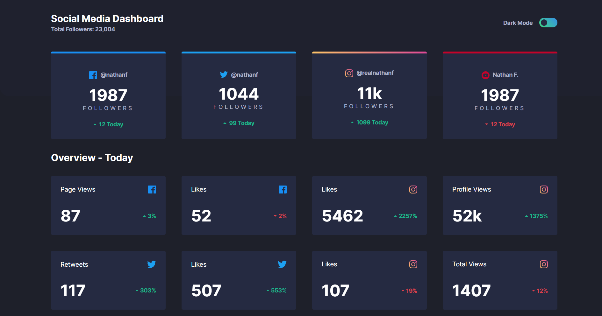
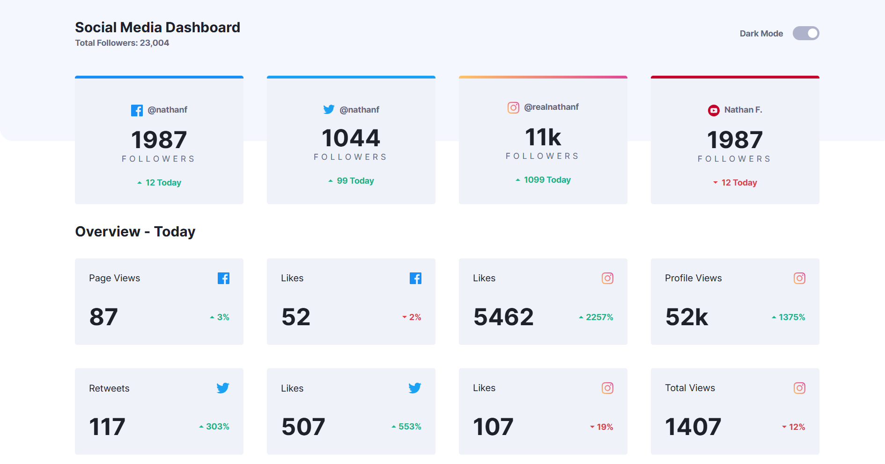
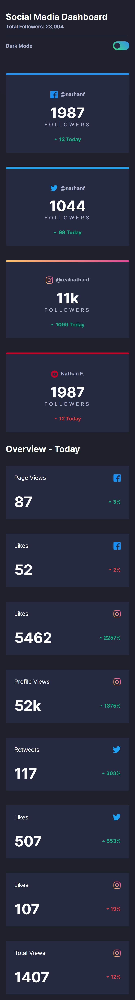
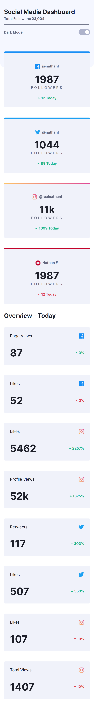

# Frontend Mentor – Social Media Dashboard with Theme Switcher

This is my solution to the **Social Media Dashboard with Theme Switcher** challenge on Frontend Mentor.
The project focuses on building a responsive dashboard UI with a dark/light theme toggle using modern CSS techniques.

## Table of Contents

* [Overview](#overview)
  * [The Challenge](#the-challenge)
  * [Screenshot](#screenshot)
  * [Links](#links)
* [My Process](#my-process)

  * [Built With](#built-with)
  * [What I Learned](#what-i-learned)
  * [Continued Development](#continued-development)
  * [Useful Resources](#useful-resources)
* [Author](#author)
* [Acknowledgments](#acknowledgments)


## Overview

### The Challenge

Users should be able to:

* View the optimal layout depending on their device screen size
* See hover states for interactive elements
* Toggle between dark and light themes


### Screenshot
 
 
 



### Links

* **Solution URL:** [https://github.com/monicamaged5/social-media-dashboard](https://github.com/monicamaged5/social-media-dashboard-with-theme-switcher)
* **Live Site URL:** [https://monicamaged5.github.io/social-media-dashboard/](https://monicamaged5.github.io/social-media-dashboard-with-theme-switcher/)


## My Process

### Built With

* Semantic HTML5 markup
* CSS custom properties (variables)
* Flexbox
* CSS Grid
* JavaScript (theme toggle)


### What I Learned

This project helped reinforce several important frontend concepts:

* Building layouts with **CSS Grid & Flexbox**
* Creating a **theme switcher using CSS variables**
* Handling responsive spacing for different screen sizes
* Implementing UI details like gradient borders and hover states

Example of the theme variable approach:

```css
body.light{
  --bg-body: hsl(0, 100%, 100%);
  --text-primary: hsl(230, 17%, 14%);
}
```


### Continued Development

In future projects, I would like to:

* Improve accessibility and semantic structure
* Refine responsive typography & spacing systems
* Add subtle UI animations and transitions
* Explore component-based architecture


### Useful Resources

* **MDN Web Docs** – Excellent reference for CSS & layout behavior
* **CSS Tricks** – Helped with Grid & Flexbox patterns
* **Frontend Mentor Community** – Inspiration and design references


## Author

* Frontend Mentor – @monicamaged5


## Acknowledgments

Thanks to Frontend Mentor for providing realistic UI challenges that help sharpen practical frontend skills.
